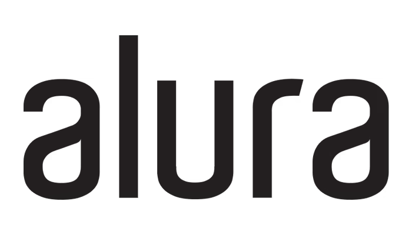
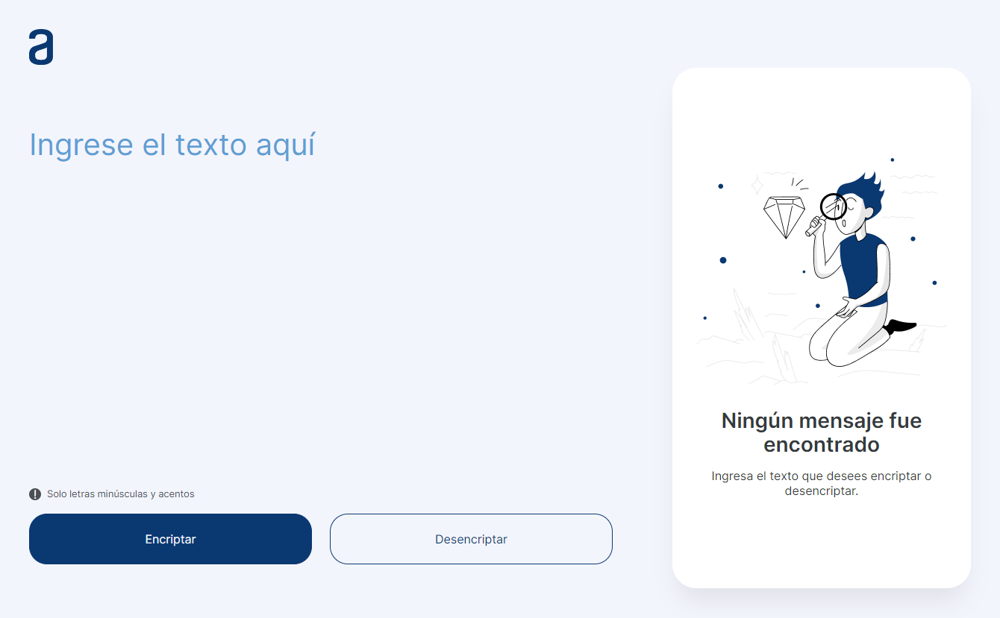

# Encriptador de texto Alura Challenges ONE G5 - 2023

|  |  |
|:---:|:---:|

## 📝 Descripción del desafío
El proyecto es una aplicación que debe encriptar y desencriptar texto 🔒. La encriptación se realiza mediante la sustitución de vocales por un conjunto de letras.

### 🔑 Las "llaves" de encriptación son
|🔠  Llave |🔡  Conversión |
| ------------ | ------------ |
|a   | ai  |
| e  | enter  |
| i  | imes  |
|  o | ober  |
|   u| ufat  |

### ✅ Requisitos
🔡 Debe funcionar solo con letras minúsculas.
🚫 No deben ser utilizados letras con acentos ni caracteres especiales
🔁 Debe ser posible convertir una palabra para la versión encriptada también devolver una palabra encriptada para su versión original.
📝 La página debe tener campos para inserción del texto que será encriptado o desencriptado, y el usuario debe poder escoger entre as dos opciones.
🖥️ El resultado debe ser mostrado en la pantalla.

### 🎁 Extras
📋 Un botón que copie el texto encriptado/desencriptado para la sección de transferencia, o sea que tenga la misma funcionalidad del ctrl+C o de la opción "copiar" del menú de las aplicaciones.

## 🚀 Descripción del proyecto
🌐 Este proyecto consiste en una aplicación web construida con HTML, CSS y JavaScript Vanilla.
🛡️ Para mejorar la calidad y seguridad del código, se ha utilizado TypeScript como lenguaje de programación, ya que permite el uso de tipos estáticos y evita errores en tiempo de ejecución.
🎨 Para el estilo de la interfaz se ha empleado SASS como preprocesador de CSS, lo que facilita la organización y modularización de los estilos. Además, se ha seguido la arquitectura de CSS ATOMIT, que combina los principios de Atomic Design e ITCSS para crear un sistema de diseño escalable y mantenible.
⚡ Como herramienta de desarrollo se ha elegido Vite, que ofrece un entorno de desarrollo rápido y eficiente, con soporte para TypeScript y SASS.
🌳 Como manejador de versiones he utilizado git, que permite el control y seguimiento de los cambios realizados en el código.
### Tecnologías

	
	
	
	
	
	
	
	
	

<h2 align="center"> Work together 😄 </h2>

    
    
    
    

